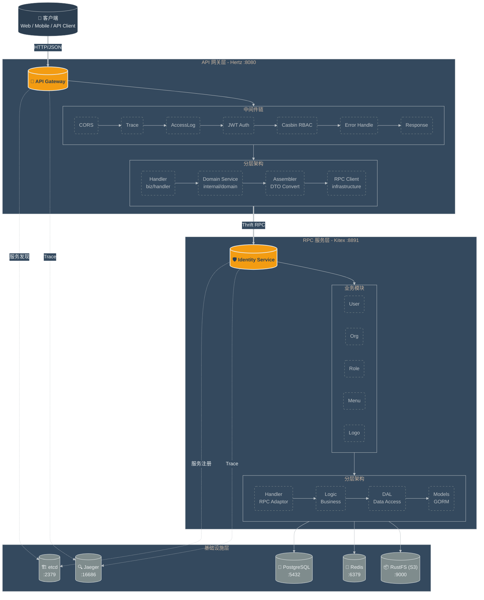

# CloudWeGo 微服务实践项目

<p align="center">
  一个基于 <a href="https://www.cloudwego.io/">CloudWeGo</a> 生态 (Kitex + Hertz) 构建的生产级微服务架构 Demo
</p>

<p align="center">
  <a href="https://go.dev/"></a>
  <a href="https://github.com/cloudwego/kitex"></a>
  <a href="https://github.com/cloudwego/hertz"></a>
  <a href="./LICENSE"></a>
</p>

## 概览

本项目演示如何使用 CloudWeGo 的 **Kitex** (RPC) 和 **Hertz** (HTTP) 框架，构建一个以**网关为核心**的微服务体系，展示以下最佳实践：

- **API 网关**: Hertz 作为统一流量入口
- **RPC 微服务**: Kitex 构建高性能 RPC 服务
- **权限管理**: Casbin RBAC 权限引擎
- **整洁架构**: 业务逻辑、数据处理与框架分离
- **依赖注入**: Google Wire 编译时依赖注入
- **用户认证**: JWT Token 认证
- **可观测性**: OpenTelemetry 链路追踪

## 架构设计



**关键设计决策**：
- **星型拓扑**: 所有 RPC 调用由网关发起，服务间不直接调用
- **IDL-First**: Thrift 作为接口定义语言
- **编译时依赖注入**: Google Wire 完成依赖注入

## 技术栈

| 组件 | 技术 |
|------|------|
| RPC 框架 | [Kitex](https://github.com/cloudwego/kitex) |
| HTTP 框架 | [Hertz](https://github.com/cloudwego/hertz) |
| 接口定义 | Thrift |
| 数据库 | PostgreSQL + [GORM](https://gorm.io/) |
| 服务发现 | etcd |
| 缓存 | Redis |
| 权限引擎 | [Casbin](https://casbin.org/) |
| 依赖注入 | [Google Wire](https://github.com/google/wire) |
| 可观测性 | [OpenTelemetry](https://opentelemetry.io/) |

## 快速开始

### 环境要求

- Go 1.24+
- Docker 20.10+ / Podman 4.0+
- Docker Compose 2.0+ / podman-compose

### 使用 Docker 运行

```bash
# 1. 克隆仓库
git clone https://github.com/masonsxu/cloudwego-microservice-demo.git
cd cloudwego-microservice-demo

# 2. 启动基础设施（PostgreSQL、etcd、Redis、RustFS、Jaeger）
cd docker && podman-compose up -d

# 3. 启动 RPC 服务（新终端）
cd rpc/identity_srv && sh build.sh && sh output/bootstrap.sh

# 4. 启动网关服务（新终端）
cd gateway && sh build.sh && sh output/bootstrap.sh

# 5. 验证
curl http://localhost:8080/ping
# 返回: {"message":"pong"}
```

### 访问入口

- **API 网关**: http://localhost:8080
- **Swagger 文档**: http://localhost:8080/swagger/index.html
- **Jaeger 链路追踪**: http://localhost:16686

## 项目结构

```
cloudwego-microservice-demo/
├── gateway/              # HTTP 网关 (Hertz)
├── rpc/
│   └── identity_srv/     # 身份认证 RPC 服务 (Kitex)
├── idl/                  # Thrift IDL 定义
├── docker/               # Docker 部署配置
└── docs/                 # 项目文档
```

## 文档

详细文档请查看 [docs/](docs/README.md)：

- [快速开始](docs/01-快速入门/快速开始.md)
- [架构设计](docs/00-项目概览/架构设计.md)
- [开发指南](docs/02-开发规范/开发指南.md)
- [配置参考](docs/01-快速入门/配置参考.md)
- [部署指南](docs/03-部署运维/部署指南.md)
- [故障排查](docs/03-部署运维/故障排查.md)
- [权限管理](docs/04-权限管理/权限管理设计.md)
- [奢华摩羯座配色规范](docs/05-UI设计/配色规范.md)
- [测试指南](docs/02-开发规范/测试指南.md)

## 测试

### 运行测试

```bash
# 运行所有测试
go test ./... -v

# 生成测试覆盖率报告
./scripts/generate-coverage-report.sh

# 或手动生成
cd rpc/identity_srv && go test ./... -coverprofile=coverage.out
go tool cover -html=coverage.out
```

### 测试覆盖率

| 模块 | 覆盖率 | 状态 |
|------|--------|------|
| pkg/errno | 100.0% | ✅ |
| pkg/log | 84.8% | ✅ |
| pkg/password | 83.3% | ✅ |
| internal/middleware | 89.1% | ✅ |
| biz/converter | 60.0% | ⚠️ |
| biz/dal | 0.0% | ❌ |
| biz/logic | 0.0% | ❌ |

详细的测试指南请参考 [测试文档](docs/02-开发规范/测试指南.md)。

## 许可证

本项目基于 [MIT License](./LICENSE) 开源。
