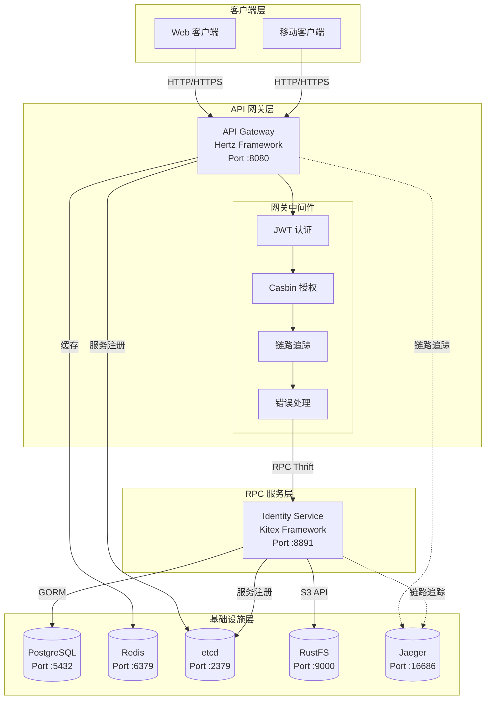
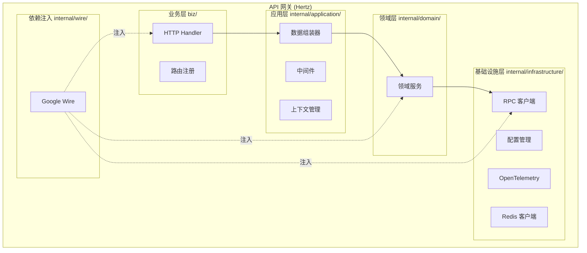
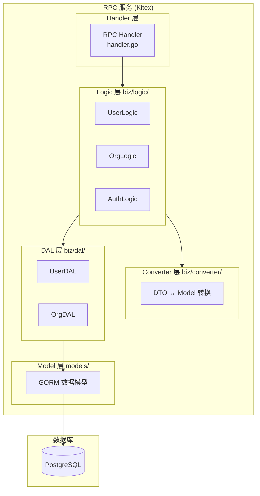
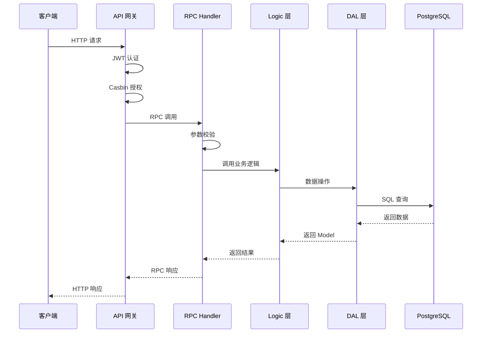
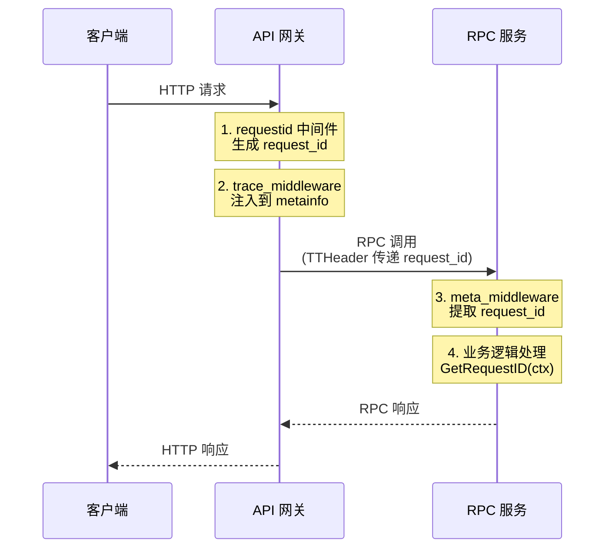
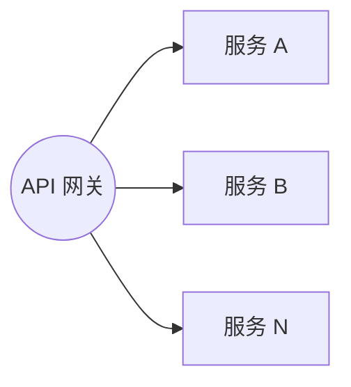

# 架构设计

本文档介绍项目的整体架构设计和技术选型。

## 目录

- [微服务架构](#微服务架构)
- [服务列表](#服务列表)
- [API 网关架构](#api-网关架构)
- [RPC 服务架构](#rpc-服务架构)
- [请求追踪链](#请求追踪链)
- [技术栈](#技术栈)
- [关键设计决策](#关键设计决策)

---

## 微服务架构



### 架构特点

| 特点 | 说明 |
|------|------|
| **星型拓扑** | 网关为中心，RPC 服务不互相调用 |
| **协议转换** | HTTP → Thrift RPC |
| **服务发现** | 基于 etcd 的动态服务发现 |
| **统一入口** | 所有外部请求通过网关 |
| **安全分层** | 认证授权集中在网关层 |

---

## 服务列表

| 服务 | 框架 | 端口 | 描述 |
|------|------|------|------|
| **gateway** | Hertz | 8080 | HTTP 网关，统一 API 入口 |
| **identity_srv** | Kitex | 8891 | 身份认证 RPC 服务 |

---

## API 网关架构



### 网关目录结构

```
gateway/
├── biz/                      # 业务层（IDL 生成）
│   ├── handler/              # HTTP Handler
│   ├── model/                # HTTP DTO
│   └── router/               # 路由注册
├── internal/
│   ├── application/          # 应用层
│   │   ├── assembler/        # 数据组装器
│   │   ├── middleware/       # 中间件（JWT、Casbin、Trace）
│   │   └── context/          # 上下文管理
│   ├── domain/               # 领域层
│   │   └── service/          # 领域服务
│   ├── infrastructure/       # 基础设施层
│   │   ├── client/           # RPC 客户端
│   │   ├── config/           # 配置管理
│   │   ├── otel/             # OpenTelemetry
│   │   └── redis/            # Redis 客户端
│   └── wire/                 # 依赖注入
├── docs/                     # Swagger 文档
└── main.go                   # 入口
```

---

## RPC 服务架构



### RPC 服务目录结构

```
rpc/identity_srv/
├── handler.go                # RPC 接口实现
├── biz/                      # 业务逻辑层
│   ├── logic/                # 业务逻辑
│   │   ├── user/
│   │   ├── organization/
│   │   └── authentication/
│   ├── dal/                  # 数据访问层
│   │   ├── user/
│   │   └── organization/
│   └── converter/            # DTO ↔ Model 转换
│       ├── user/
│       └── organization/
├── models/                   # GORM 数据模型
├── kitex_gen/                # IDL 生成代码（勿修改）
├── config/                   # 配置管理
├── wire/                     # 依赖注入
└── internal/
    └── middleware/           # RPC 中间件
```

### 分层职责

| 层 | 职责 | 位置 |
|----|------|------|
| **Handler** | 参数校验、错误转换、响应构建 | `handler.go` |
| **Logic** | 核心业务逻辑、编排 DAL 操作 | `biz/logic/` |
| **DAL** | 数据持久化、封装 GORM 操作 | `biz/dal/` |
| **Converter** | DTO 与 Model 纯函数转换 | `biz/converter/` |

### 数据流向



---

## 请求追踪链

项目采用基于 **metainfo** 的链路追踪机制，使用 `request_id` 追踪请求在微服务调用链中的完整路径。



### 追踪特性

- **唯一追踪标识**：使用 `request_id` 进行全链路追踪
- **自动生成**：缺失的 request_id 自动生成
- **直接使用 metainfo**：不使用 context.WithValue，性能更优
- **100% 可追踪**：确保每个请求都有完整的追踪信息

---

## 技术栈

### 核心框架

| 组件 | 技术 | 说明 |
|------|------|------|
| RPC 框架 | [Kitex](https://github.com/cloudwego/kitex) | CloudWeGo 高性能 RPC |
| HTTP 框架 | [Hertz](https://github.com/cloudwego/hertz) | CloudWeGo 高性能 HTTP |
| 接口协议 | Thrift | IDL 定义 |

### 基础设施

| 组件 | 技术 | 说明 |
|------|------|------|
| 数据库 | PostgreSQL + GORM | 关系型数据库 |
| 缓存 | Redis | 会话管理、热点数据缓存 |
| 服务发现 | etcd | 服务注册与发现 |
| 对象存储 | RustFS | S3 兼容存储 |
| 链路追踪 | Jaeger + OpenTelemetry | 分布式链路追踪 |
| 依赖注入 | Google Wire | 编译时依赖注入 |

---

## 关键设计决策

### 1. 星型拓扑架构

**决策**：所有 RPC 调用由网关发起，RPC 服务之间不直接调用。



**优势**：
- 简化微服务拓扑
- 统一管理认证、追踪、降级
- 易于监控和故障排查
- 降低服务间耦合

### 2. 安全分层设计

**决策**：所有鉴权逻辑（JWT、权限校验）在网关层处理，RPC 服务不处理权限。

**优势**：
- 单点控制安全策略
- RPC 服务保持简单
- 便于安全审计

### 3. 环境变量驱动配置

**决策**：不使用 YAML 配置文件，所有配置通过环境变量或 `.env` 文件提供。

**优势**：
- 便于容器化部署
- 符合 12-Factor App 原则
- 环境隔离更清晰

### 4. Wire 编译时依赖注入

**决策**：使用 Google Wire 进行编译时依赖注入。

**优势**：
- 类型安全，编译时检查
- 无运行时反射开销
- 依赖关系清晰可追踪

### 5. Redis 缓存层

**决策**：在网关层引入 Redis 缓存，用于会话管理和热点数据缓存。

**用途**：
- JWT Token 黑名单
- 用户会话状态
- 权限数据缓存
- API 限流计数

### 6. OpenTelemetry 链路追踪

**决策**：集成 OpenTelemetry 和 Jaeger 实现端到端链路追踪。

**优势**：
- 分布式系统调用链可视化
- 性能瓶颈快速定位
- 错误根因分析

---

## 下一步

- [03-开发指南](03-development.md) - 了解如何开发新功能
- [04-配置参考](04-configuration.md) - 详细的配置参考
