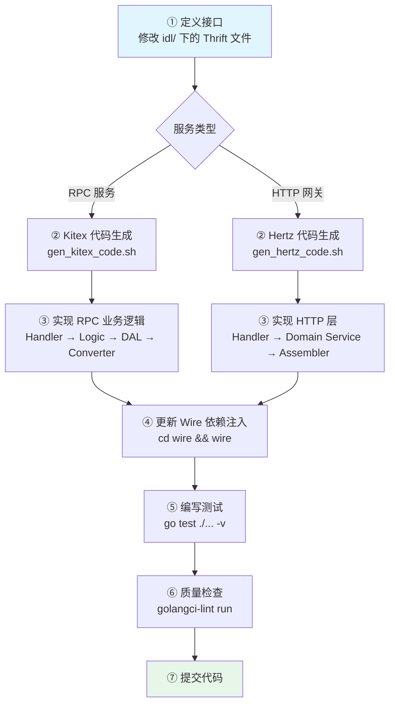
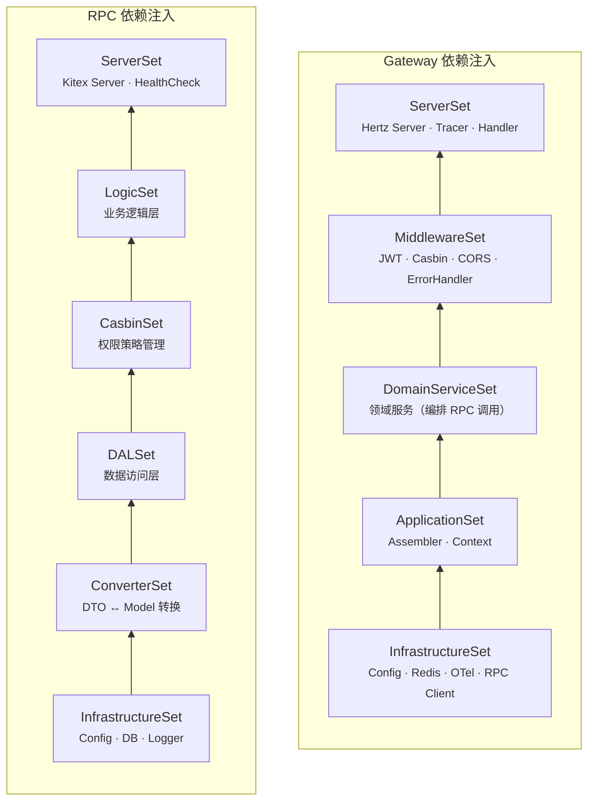
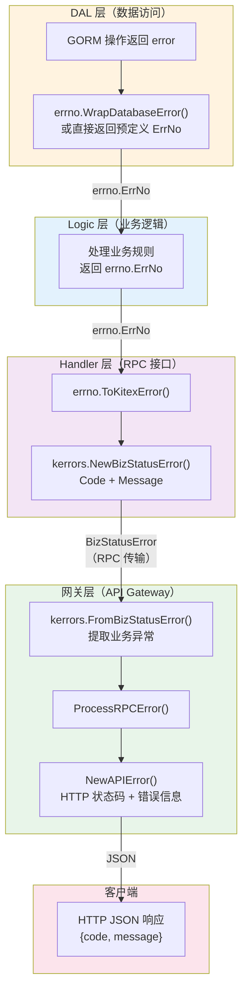

# 开发指南

本文档介绍项目的开发规范和常用命令。

## 目录

- [IDL-First 开发流程](#idl-first-开发流程)
- [代码生成](#代码生成)
- [分层开发规范](#分层开发规范)
- [Wire 依赖注入](#wire-依赖注入)
- [错误处理规范](#错误处理规范)
- [常用命令](#常用命令)
- [代码规范](#代码规范)

---

## IDL-First 开发流程

项目严格遵循 **IDL-First** 开发模式：

```
1. 定义接口     →  修改 idl/ 目录下的 Thrift 文件
       ↓
2. 生成代码     →  使用 Kitex/Hertz 工具自动生成
       ↓
3. 实现业务逻辑  →  在 biz/ 目录下实现具体逻辑
       ↓
4. 测试验证     →  编写单元测试和集成测试
```



> 来源：`rpc/identity_srv/script/gen_kitex_code.sh`、`gateway/script/gen_hertz_code.sh`

### 示例：添加新的 RPC 接口

```bash
# 1. 修改 IDL 文件
vim idl/rpc/identity_srv/identity_service.thrift

# 2. 生成 Kitex 代码
cd rpc/identity_srv
./script/gen_kitex_code.sh

# 3. 实现业务逻辑
# - biz/logic/role/ 业务逻辑
# - biz/dal/role/ 数据访问层
# - biz/converter/role/ 转换器

# 4. 在 handler.go 中实现接口
vim handler.go

# 5. 更新 Wire 依赖注入
cd wire && wire

# 6. 编写测试
go test ./biz/logic/role/... -v
```

---

## 代码生成

### Kitex RPC 代码

```bash
cd rpc/identity_srv
./script/gen_kitex_code.sh
```

### Hertz HTTP 代码

```bash
cd gateway
./script/gen_hertz_code.sh               # 生成所有服务
./script/gen_hertz_code.sh identity      # 仅生成 identity 服务
```

### Wire 依赖注入

```bash
# RPC 服务
cd rpc/identity_srv/wire && wire

# HTTP 网关
cd gateway/internal/wire && wire
```

---

## 分层开发规范

### Handler 层

职责：参数校验、调用转换器、委托业务逻辑层

```go
func (s *IdentityServiceImpl) CreateUser(ctx context.Context, req *identity_srv.CreateUserReq) (*identity_srv.CreateUserResp, error) {
    // 1. 参数校验
    if req.Username == "" {
        return nil, errno.ToKitexError(errno.ErrInvalidParam.WithMessage("用户名不能为空"))
    }

    // 2. 调用转换器：DTO → Model
    userModel := converter.ToUserModel(req)

    // 3. 委托业务逻辑层
    createdUser, err := s.userLogic.CreateUser(ctx, userModel)
    if err != nil {
        return nil, errno.ToKitexError(err)
    }

    // 4. 调用转换器：Model → DTO
    return &identity_srv.CreateUserResp{
        User: converter.ToUserDTO(createdUser),
    }, nil
}
```

### Logic 层

职责：核心业务逻辑、编排 DAL 层操作

```go
type UserLogic struct {
    userDAL *dal.UserDAL
}

func (l *UserLogic) CreateUser(ctx context.Context, user *models.User) (*models.User, error) {
    // 1. 业务规则校验
    if err := l.validateUser(user); err != nil {
        return nil, err
    }

    // 2. 密码加密
    hashedPassword, err := bcrypt.GenerateFromPassword([]byte(user.Password), bcrypt.DefaultCost)
    if err != nil {
        return nil, errno.ErrInternalServer
    }
    user.PasswordHash = string(hashedPassword)

    // 3. 调用 DAL 层持久化
    if err := l.userDAL.Create(ctx, user); err != nil {
        return nil, err
    }

    return user, nil
}
```

### DAL 层

职责：数据持久化、封装 GORM 操作、错误转换

```go
type UserDAL struct {
    db *gorm.DB
}

func (d *UserDAL) Create(ctx context.Context, user *models.User) error {
    if err := d.db.WithContext(ctx).Create(user).Error; err != nil {
        // 转换 GORM 错误为业务错误
        if errors.Is(err, gorm.ErrDuplicatedKey) {
            return errno.ErrUserAlreadyExists
        }
        return errno.ErrDatabaseOperation.WithCause(err)
    }
    return nil
}
```

### Converter 层

职责：DTO 与 Model 之间的纯函数转换

```go
func ToUserModel(req *identity_srv.CreateUserReq) *models.User {
    return &models.User{
        Username:    req.Username,
        Email:       req.Email,
        PhoneNumber: req.PhoneNumber,
        Password:    req.Password,
    }
}

func ToUserDTO(user *models.User) *identity_srv.User {
    return &identity_srv.User{
        Id:          user.ID,
        Username:    user.Username,
        Email:       user.Email,
        PhoneNumber: user.PhoneNumber,
        CreatedAt:   user.CreatedAt.Unix(),
    }
}
```

---

## Wire 依赖注入

### 添加新的 Provider

```go
// wire/provider.go
func ProvideUserLogic(userDAL *dal.UserDAL) *logic.UserLogic {
    return logic.NewUserLogic(userDAL)
}

// wire/wire.go
var LogicSet = wire.NewSet(
    ProvideUserLogic,
    // 其他 Logic Providers...
)
```

### 重新生成

```bash
cd rpc/identity_srv/wire  # 或 gateway/internal/wire
wire
```

### 依赖注入层次关系



> 来源：`gateway/internal/wire/wire.go`、`rpc/identity_srv/wire/wire.go`

---

## 错误处理规范

### 错误码规范

项目采用 6 位数字业务错误码：

```go
// pkg/errno/code.go
const (
    // 用户相关错误 (100xxx)
    CodeUserNotFound      = 100001
    CodeUserAlreadyExists = 100002
    CodeInvalidPassword   = 100003
)

var (
    ErrUserNotFound      = New(CodeUserNotFound, "用户不存在")
    ErrUserAlreadyExists = New(CodeUserAlreadyExists, "用户已存在")
    ErrInvalidPassword   = New(CodeInvalidPassword, "密码错误")
)
```

### 错误处理流程



> 来源：`rpc/identity_srv/pkg/errno/error.go:38-54`、`gateway/internal/infrastructure/errors/rpc_handler.go:28-41`

---

## 常用命令

### 服务启动

```bash
# 一键启动全栈（基础设施 + identity_srv + gateway）
podman kube play docker/pod.yml

# 修改代码后重新部署
./scripts/build-images.sh                  # 全部构建（或指定 identity / gateway）
podman kube play --down docker/pod.yml
podman kube play docker/pod.yml

# 查看状态与日志
podman pod ps                                         # 所有 Pod 状态
podman logs -f gateway-pod-gateway                    # gateway 日志
podman logs -f identity-srv-pod-identity-srv          # identity_srv 日志
```

### 测试命令

```bash
# 运行所有测试
go test ./... -v

# 单个包测试
go test -v ./biz/logic/user_profile/...

# 测试覆盖率
go test ./... -coverprofile=coverage.out -v
go tool cover -html=coverage.out

# 性能测试
go test -bench=. -benchmem ./...
```

### 构建命令

```bash
# 构建容器镜像（identity-srv:latest 和 gateway:latest）
./scripts/build-images.sh                  # 全部
./scripts/build-images.sh identity         # 只构建 identity-srv
./scripts/build-images.sh gateway          # 只构建 gateway
```

---

## 代码规范

### Git 提交规范

```
feat: 新功能
fix: 修复 bug
refactor: 重构代码
docs: 文档更新
test: 测试相关
chore: 构建/工具链更新
```

### 代码检查

```bash
# 运行检查
golangci-lint run

# 自动修复
golangci-lint run --fix

# 格式化
gofmt -w .
```

### Git Hooks

```bash
# 安装 pre-commit 钩子
ln -s -f ../../scripts/git-hooks/pre-commit .git/hooks/pre-commit
```

---

## 可观测性开发

### 链路追踪

```go
// 在 Handler 中添加自定义 span
func (s *IdentityServiceImpl) CreateUser(ctx context.Context, req *identity_srv.CreateUserReq) (*identity_srv.CreateUserResp, error) {
    ctx, span := otel.Tracer("identity-service").Start(ctx, "CreateUser")
    defer span.End()

    span.SetAttributes(
        attribute.String("user.username", req.Username),
        attribute.String("operation", "create_user"),
    )

    // 业务逻辑...
}
```

### 结构化日志

```go
import "github.com/rs/zerolog/log"

log.Info().
    Str("trace_id", traceID).
    Str("user_id", userID).
    Str("operation", "create_user").
    Msg("User created successfully")
```

---

## 下一步

- [配置参考](../01-快速入门/配置参考.md) - 环境变量详解
- [部署指南](../03-部署运维/部署指南.md) - 生产环境部署
- [故障排查](../03-部署运维/故障排查.md) - 常见问题处理

## 前端数据类型约定

### 时间戳格式（重要）

**规则**：后端返回的所有时间字段均为**毫秒级时间戳**（13位整数）。

#### 定义

- **类型**：`number`（非字符串）
- **单位**：毫秒（milliseconds）
- **示例**：`1766021112386`

#### TypeScript 类型定义

```typescript
// ✅ 正确
interface UserProfile {
  created_at: number  // 毫秒时间戳
  updated_at?: number
}

// ❌ 错误
interface UserProfile {
  created_at: string  // 不要用字符串
  created_at: Date    // 不要用 Date 对象
}
```

#### 使用工具函数

```typescript
import { formatTimestamp, formatRelativeTime } from '@/utils/date'

// 格式化时间
const displayTime = formatTimestamp(user.created_at)  // '2025-01-01 12:00:00'

// 相对时间
const relativeTime = formatRelativeTime(user.created_at)  // '3个月前'
```

详见：`web/开发规范.md`
