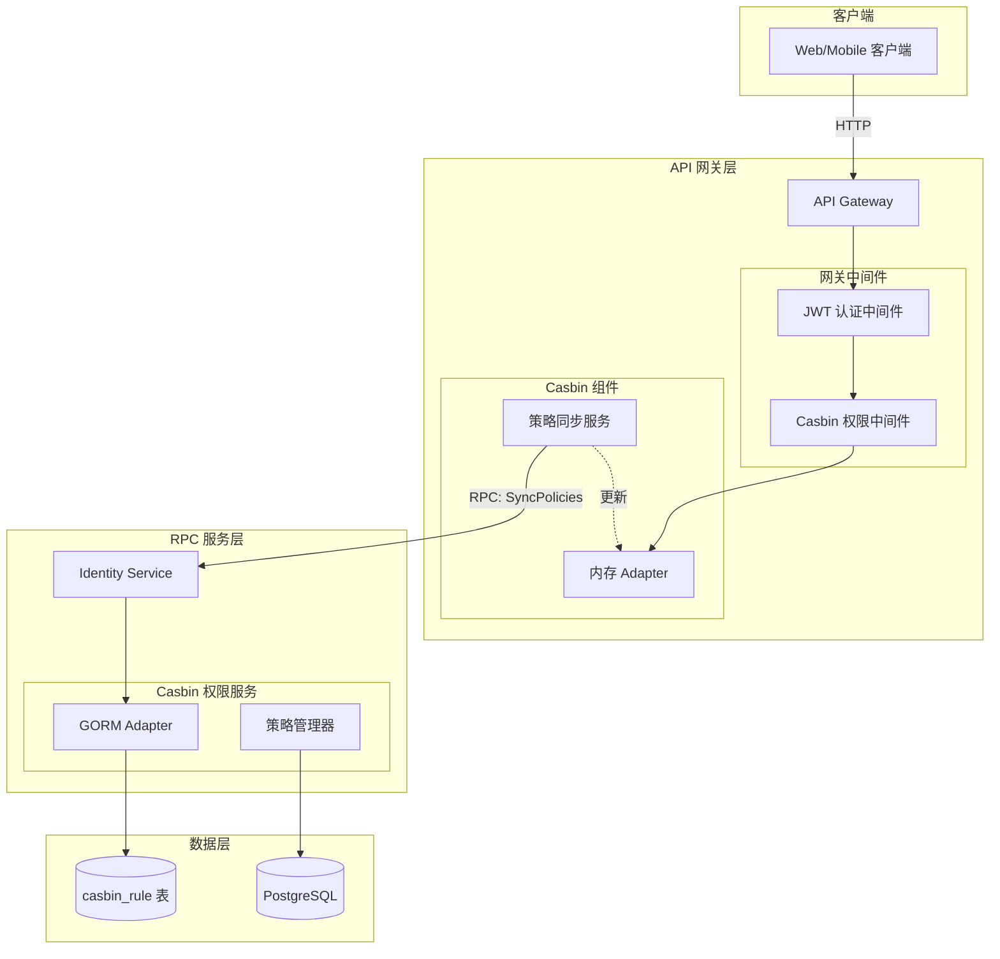
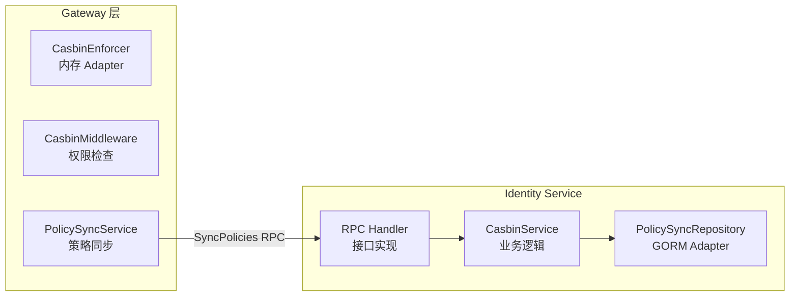
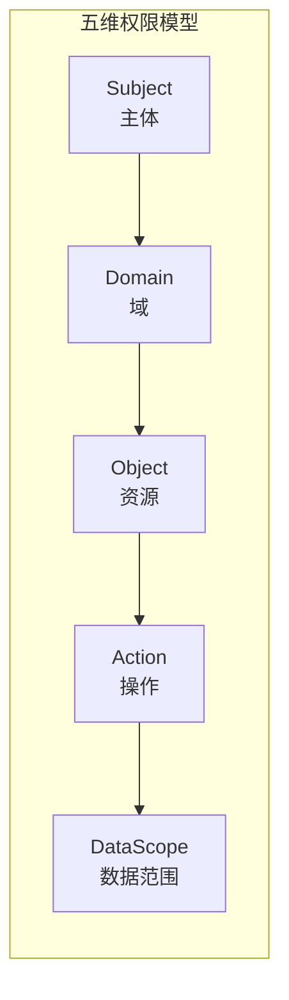
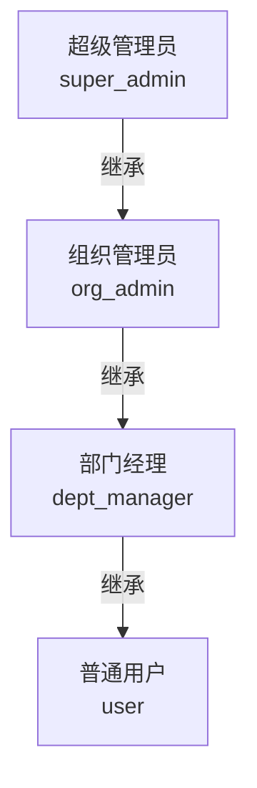
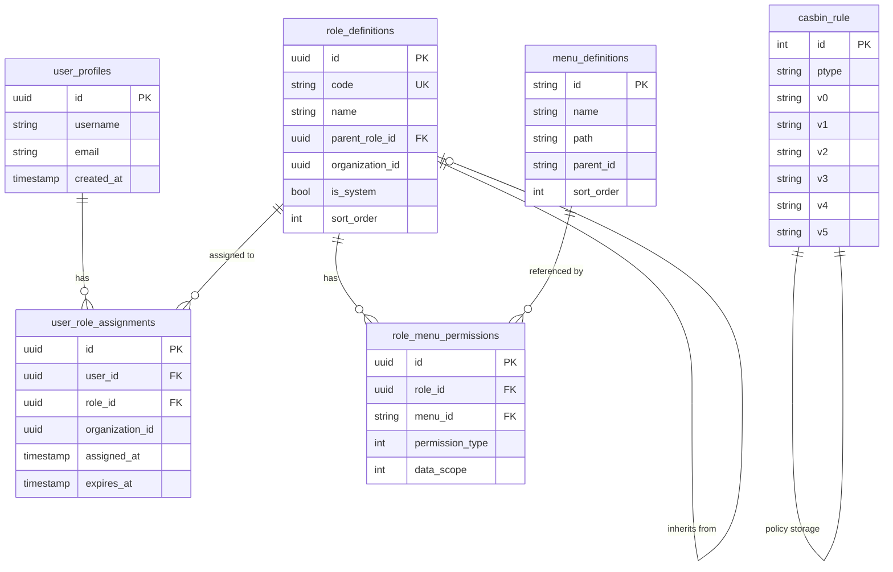
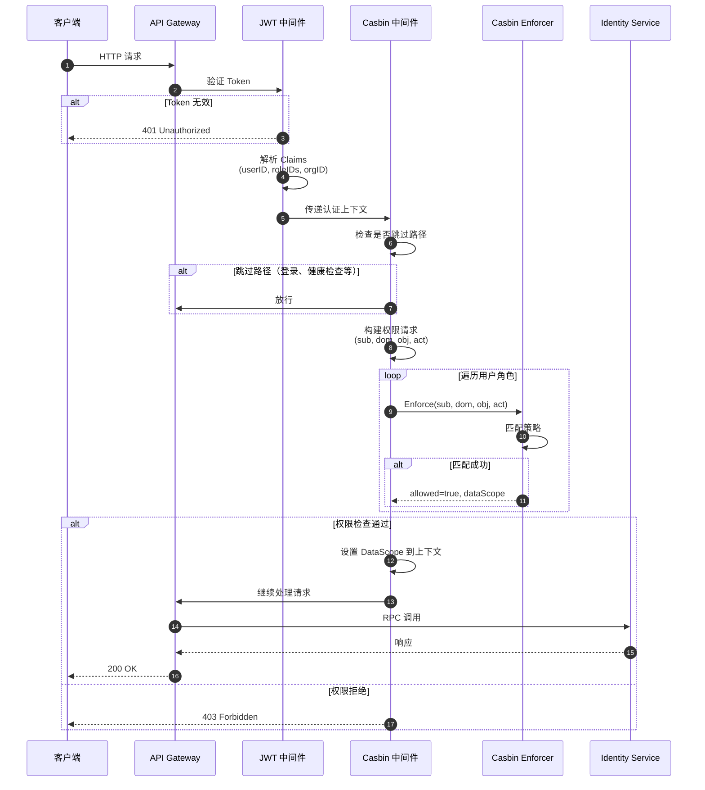
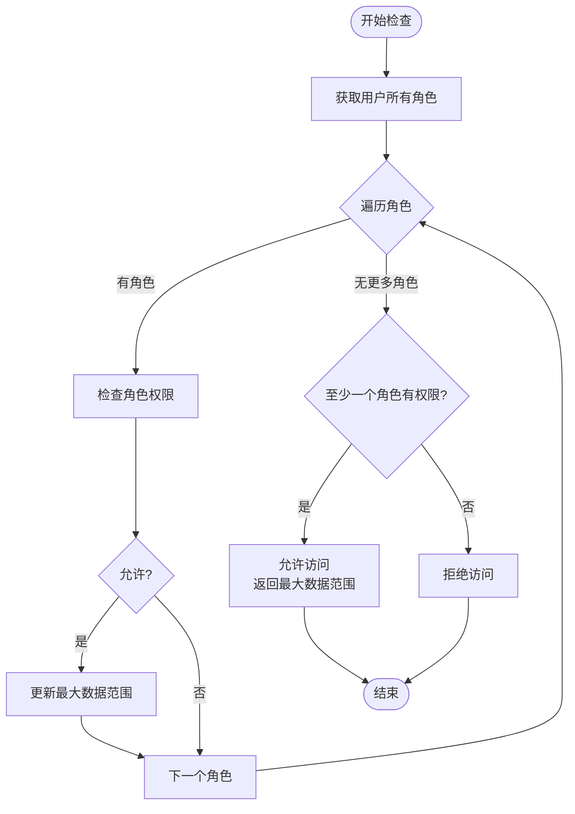
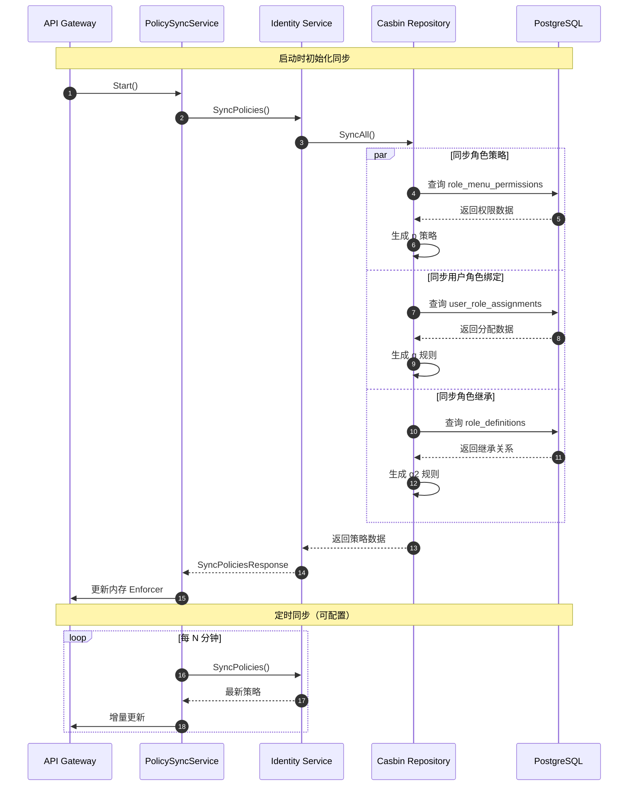
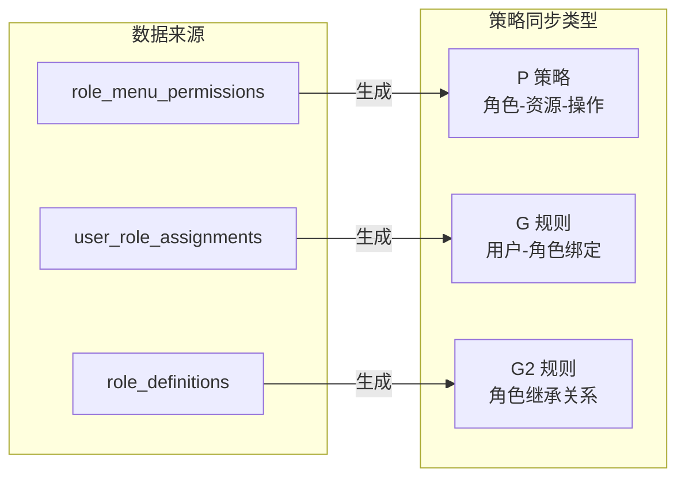

# 权限管理模块设计文档

本文档介绍基于 Casbin 的 RBAC 权限管理模块的功能设计与实现。

## 目录

- [模块概述](#模块概述)
- [架构设计](#架构设计)
- [核心概念](#核心概念)
- [数据模型](#数据模型)
- [API 接口](#api-接口)
- [权限检查流程](#权限检查流程)
- [策略同步机制](#策略同步机制)
- [配置说明](#配置说明)
- [使用示例](#使用示例)

---

## 模块概述

权限管理模块基于 **Casbin** 实现 RBAC（基于角色的访问控制）权限引擎，支持：

| 特性 | 说明 |
|------|------|
| **五维权限模型** | 用户、角色、资源、操作、数据范围 |
| **多角色支持** | 用户可拥有多个角色，权限取并集 |
| **角色继承** | 支持角色层级继承关系 |
| **数据范围控制** | 支持 self/dept/org 三级数据权限 |
| **动态策略同步** | Gateway 从 RPC 服务同步策略 |

---

## 架构设计

### 混合模式架构

采用 **混合模式（Hybrid Mode）** 作为微服务架构下的最佳实践：



### 架构优势

| 优势 | 说明 |
|------|------|
| **网关无状态** | Gateway 不直接访问数据库，符合微服务原则 |
| **策略集中管理** | Identity Service 作为策略的唯一权威来源 |
| **高性能鉴权** | Gateway 使用内存 Adapter，鉴权延迟极低 |
| **多实例一致性** | 多个 Gateway 实例可通过同步保持策略一致 |
| **便于审计** | 所有策略变更在 Identity Service 统一管理 |

### 组件职责



---

## 核心概念

### 五维权限模型



| 维度 | 说明 | 示例 |
|------|------|------|
| **Subject (sub)** | 权限主体，通常是角色 | `role:admin`, `role:user` |
| **Domain (dom)** | 权限域，通常是组织 | `org:uuid`, `*` |
| **Object (obj)** | 资源对象 | `menu:users`, `/api/v1/users/*` |
| **Action (act)** | 操作动作 | `read`, `write`, `manage`, `*` |
| **DataScope** | 数据范围 | `self`, `dept`, `org` |

### Casbin 模型定义

```ini
[request_definition]
r = sub, dom, obj, act

[policy_definition]
p = sub, dom, obj, act, data_scope

[role_definition]
g = _, _, _      # 用户-角色-域 绑定
g2 = _, _        # 角色继承关系

[policy_effect]
e = some(where (p.eft == allow))

[matchers]
m = (g(r.sub, p.sub, r.dom) || g(r.sub, p.sub, "*")) &&
    (r.dom == p.dom || p.dom == "*") &&
    keyMatch2(r.obj, p.obj) &&
    (r.act == p.act || p.act == "*")
```

### 角色继承

支持角色层级继承，子角色自动继承父角色的所有权限：



### 数据范围

数据范围控制用户可访问的数据边界：

| 范围 | 说明 | 优先级 |
|------|------|--------|
| `self` | 仅自己的数据 | 1 (最低) |
| `dept` | 本部门及下级部门数据 | 2 |
| `org` | 全组织数据 | 3 (最高) |

当用户拥有多个角色时，数据范围取最大值（权限并集）。

---

## 数据模型

### 数据库表结构



### Casbin 策略存储格式

`casbin_rule` 表存储策略数据：

| ptype | v0 | v1 | v2 | v3 | v4 | 说明 |
|-------|----|----|----|----|-----|------|
| `p` | role:admin | org:uuid | menu:users | write | org | 角色权限策略 |
| `g` | user:uuid | role:admin | org:uuid | - | - | 用户角色绑定 |
| `g2` | role:admin | role:super_admin | - | - | - | 角色继承关系 |

---

## API 接口

### RPC 接口

Identity Service 提供以下 RPC 接口：

```thrift
// 策略同步接口
service IdentityService {
    // 同步所有策略数据
    SyncPoliciesResponse SyncPolicies()

    // 检查权限
    CheckPermissionResponse CheckPermission(1: CheckPermissionRequest req)

    // 获取用户数据范围
    GetUserDataScopeResponse GetUserDataScope(1: GetUserDataScopeRequest req)
}

struct SyncPoliciesResponse {
    1: optional bool success
    2: optional i32 rolePolicyCount
    3: optional i32 userRoleBindingCount
    4: optional i32 roleInheritanceCount
    5: optional string message
}

struct CheckPermissionRequest {
    1: optional UUID userID
    2: optional list<string> roleIDs
    3: optional list<string> departmentIDs
    4: optional string resource
    5: optional string action
}

struct CheckPermissionResponse {
    1: optional bool allowed
    2: optional string dataScope
    3: optional UUID userID
    4: optional string resource
    5: optional string action
}
```

### HTTP 接口

Gateway 暴露的 HTTP 接口：

| 方法 | 路径 | 说明 |
|------|------|------|
| GET | `/api/v1/permission/check` | 检查当前用户权限 |
| POST | `/api/v1/admin/permission/sync` | 触发策略同步（管理员） |

---

## 权限检查流程

### 完整鉴权流程



### 多角色权限合并

当用户拥有多个角色时，权限检查逻辑：



### HTTP Method 到 Action 映射

```go
// HTTP 方法映射到 Casbin Action
var methodActionMap = map[string]string{
    "GET":     "read",
    "HEAD":    "read",
    "OPTIONS": "read",
    "POST":    "write",
    "PUT":     "write",
    "PATCH":   "write",
    "DELETE":  "manage",
}
```

---

## 策略同步机制

### 同步流程



### 同步策略类型



### 同步配置

```go
type PolicySyncConfig struct {
    // 同步间隔
    SyncInterval time.Duration `env:"CASBIN_SYNC_INTERVAL" default:"5m"`

    // 启动时是否同步
    SyncOnStart bool `env:"CASBIN_SYNC_ON_START" default:"true"`

    // 同步超时
    SyncTimeout time.Duration `env:"CASBIN_SYNC_TIMEOUT" default:"30s"`
}
```

---

## 配置说明

### Gateway 配置

| 环境变量 | 说明 | 默认值 |
|----------|------|--------|
| `CASBIN_ENABLED` | 是否启用 Casbin 中间件 | `true` |
| `CASBIN_SKIP_PATHS` | 跳过检查的路径（逗号分隔） | `/login,/health` |
| `CASBIN_SYNC_INTERVAL` | 策略同步间隔 | `5m` |
| `CASBIN_SYNC_ON_START` | 启动时是否同步 | `true` |

### Identity Service 配置

Casbin 使用 GORM Adapter，复用现有数据库配置：

| 环境变量 | 说明 |
|----------|------|
| `DATABASE_DSN` | PostgreSQL 连接字符串 |

---

## 使用示例

### 1. 添加角色权限

```go
// 在 Identity Service 中添加角色权限
err := casbinRepo.AddRolePolicy(ctx,
    "role:admin",           // 角色
    "org:123",              // 组织域
    "menu:users",           // 资源
    "write",                // 操作
    "org",                  // 数据范围
)
```

### 2. 绑定用户角色

```go
// 将用户绑定到角色
err := casbinRepo.AddUserRoleBinding(ctx,
    "user:456",             // 用户 ID
    "role:admin",           // 角色
    "org:123",              // 组织域
)
```

### 3. 设置角色继承

```go
// 设置角色继承关系
err := casbinRepo.AddRoleInheritance(ctx,
    "role:dept_manager",    // 子角色
    "role:org_admin",       // 父角色
)
```

### 4. 检查权限

```go
// 在 Gateway 中检查权限
allowed, dataScope := middleware.CheckPermission(ctx,
    "user:456",             // 用户
    "org:123",              // 域
    "/api/v1/users/789",    // 资源
    "write",                // 操作
)

if allowed {
    // 根据 dataScope 过滤数据
    switch dataScope {
    case "self":
        // 只返回用户自己的数据
    case "dept":
        // 返回部门数据
    case "org":
        // 返回全组织数据
    }
}
```

### 5. 触发策略同步

```go
// 手动触发策略同步
result, err := policySyncService.SyncPolicies(ctx)
if err != nil {
    log.Error().Err(err).Msg("策略同步失败")
}
log.Info().
    Int32("policies", result.RolePolicyCount).
    Int32("bindings", result.UserRoleBindingCount).
    Int32("inheritance", result.RoleInheritanceCount).
    Msg("策略同步完成")
```

---

## 最佳实践

### 1. 权限设计原则

- **最小权限原则**：默认拒绝，显式授权
- **角色分层**：使用角色继承减少重复配置
- **域隔离**：使用组织域隔离不同租户的权限

### 2. 性能优化

- **跳过路径配置**：将公开接口加入跳过列表
- **合理同步间隔**：根据业务需求设置同步频率
- **批量操作**：使用批量 API 处理大量策略变更

### 3. 安全建议

- **审计日志**：记录所有权限变更操作
- **定期审查**：定期检查和清理过期的角色分配
- **敏感操作确认**：关键权限变更需要二次确认

---

## 故障排查

### 常见问题

| 问题 | 可能原因 | 解决方案 |
|------|----------|----------|
| 权限检查始终失败 | 策略未同步 | 检查同步服务状态，手动触发同步 |
| 数据范围不正确 | 多角色合并逻辑 | 检查用户角色配置 |
| 同步超时 | 数据库连接问题 | 检查 Identity Service 数据库连接 |

### 调试日志

启用调试日志查看详细的权限检查过程：

```bash
# 设置日志级别
export LOG_LEVEL=debug

# 启用 Casbin 调试
export CASBIN_DEBUG=true
```

---

## 下一步

- [开发指南](../02-开发规范/开发指南.md) - 了解如何开发新功能
- [配置参考](../01-快速入门/配置参考.md) - 详细的配置参考
- [故障排查](../03-部署运维/故障排查.md) - 问题排查指南
