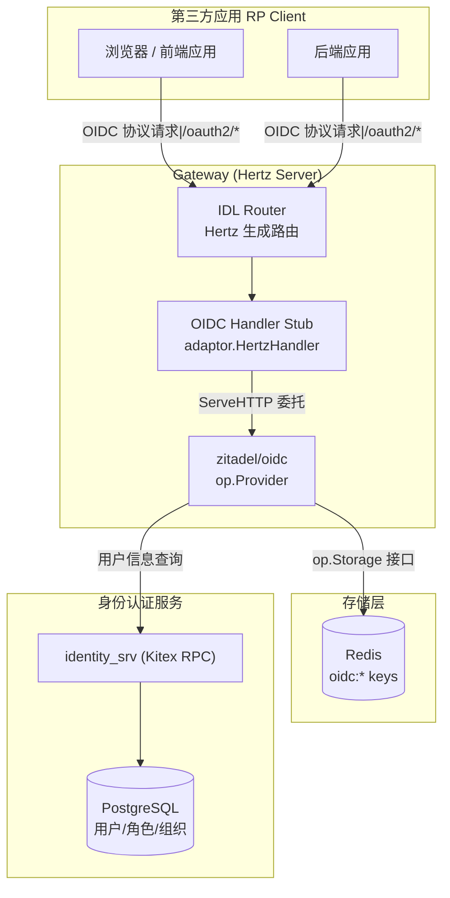
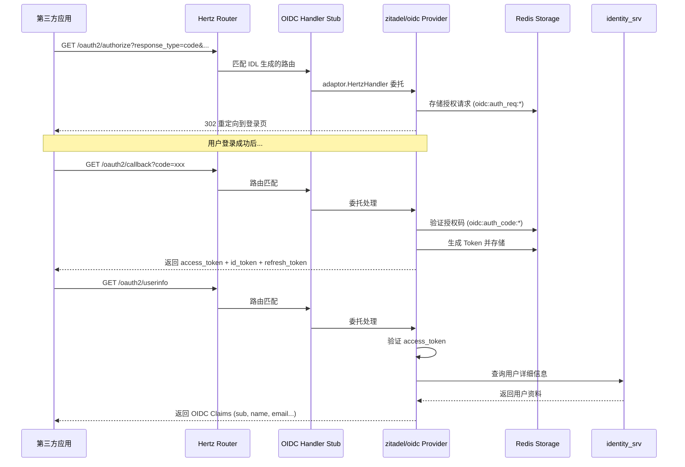
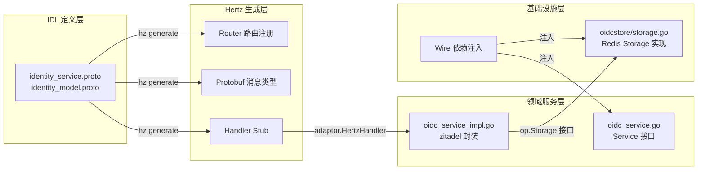

# OIDC 认证使用指南

本项目基于 [zitadel/oidc](https://github.com/zitadel/oidc) 库实现了完整的 OpenID Connect (OIDC) Provider 功能，支持标准 OIDC 协议的所有核心端点。

## 1. 架构概览

### 1.1 系统架构



### 1.2 请求处理流程



### 1.3 代码分层



**关键设计决策**：
- **zitadel/oidc 作为底层引擎**：所有 OIDC 协议逻辑由 zitadel/oidc 库处理，项目不重复造轮子
- **IDL-First 路由框架**：通过 Protobuf IDL 定义端点，Hertz 生成路由和 handler stub
- **Handler 委托模式**：生成的 handler stub 通过 `adaptor.HertzHandler` 将请求委托给 zitadel 的 `http.Handler`
- **Redis 存储**：授权码、Token、客户端信息全部存储在 Redis 中，支持水平扩展

## 2. 支持的 OIDC 端点

| 端点 | 方法 | 用途 |
|------|------|------|
| `/.well-known/openid-configuration` | GET | OIDC Discovery（自动发现配置） |
| `/oauth2/jwks` | GET | JSON Web Key Set（公钥端点） |
| `/oauth2/authorize` | GET | 授权端点（Authorization Code Flow） |
| `/oauth2/token` | POST | Token 端点（换取/刷新 Token） |
| `/oauth2/userinfo` | GET | 用户信息端点 |
| `/oauth2/revoke` | POST | Token 吊销端点 |
| `/oauth2/introspect` | POST | Token 内省端点 |

## 3. 支持的 Scopes 和 Claims

### Scopes

| Scope | 说明 |
|-------|------|
| `openid` | 必须，启用 OIDC 模式 |
| `profile` | 请求用户基本信息（name, preferred_username, picture） |
| `email` | 请求用户邮箱（email, email_verified） |
| `offline_access` | 请求 Refresh Token |

### Claims

| Claim | 类型 | 说明 |
|-------|------|------|
| `sub` | string | 用户唯一标识（subject） |
| `name` | string | 用户全名 |
| `preferred_username` | string | 用户首选用户名 |
| `email` | string | 用户邮箱 |
| `email_verified` | bool | 邮箱是否已验证 |
| `picture` | string | 用户头像 URL |

## 4. 支持的 Grant Types

| Grant Type | 说明 |
|------------|------|
| `authorization_code` | 授权码模式（推荐，支持 PKCE） |
| `refresh_token` | 刷新令牌模式 |

## 5. 配置

### 5.1 环境变量

| 环境变量 | 说明 | 默认值 |
|---|---|---|
| `OIDC_ENABLED` | 是否启用 OIDC Provider | `true` |
| `OIDC_ISSUER` | 签发者 URL，建议与网关外部访问地址一致 | `http://localhost:8080` |
| `OIDC_ACCESS_TOKEN_LIFESPAN` | Access Token 有效期 | `30m` |
| `OIDC_REFRESH_TOKEN_LIFESPAN` | Refresh Token 有效期 | `168h`（7天） |
| `OIDC_AUTH_CODE_LIFESPAN` | 授权码有效期 | `10m` |
| `OIDC_ID_TOKEN_LIFESPAN` | ID Token 有效期 | `30m` |
| `OIDC_ENFORCE_PKCE` | 是否强制 PKCE | `true` |
| `OIDC_CONSENT_PAGE_URL` | 同意页 URL（当前为空） | `""` |

### 5.2 本地开发配置

```bash
# gateway/.env
OIDC_ENABLED=true
OIDC_ISSUER=http://localhost:8080
OIDC_ACCESS_TOKEN_LIFESPAN=30m
OIDC_REFRESH_TOKEN_LIFESPAN=168h
OIDC_AUTH_CODE_LIFESPAN=10m
OIDC_ID_TOKEN_LIFESPAN=30m
OIDC_ENFORCE_PKCE=true
```

> **注意**：本地开发使用 `http://` 协议，zitadel/oidc 默认要求 `https://`。项目已启用 `op.WithAllowInsecure()` 选项以支持本地 HTTP 开发。

## 6. 使用流程

### 6.1 Authorization Code Flow + PKCE（推荐）

这是最安全的 OIDC 流程，适用于所有类型的应用（SPA、移动端、后端应用）。

#### 步骤 1：生成 PKCE 参数

```bash
# 生成 code_verifier（43-128 字符的随机字符串）
CODE_VERIFIER=$(openssl rand -base64 64 | tr -d '\n' | tr '+/' '-_' | tr -d '=')

# 生成 code_challenge（SHA256 哈希后 Base64URL 编码）
CODE_CHALLENGE=$(echo -n "$CODE_VERIFIER" | openssl dgst -sha256 -binary | openssl base64 -A | tr '+/' '-_' | tr -d '=')
```

#### 步骤 2：请求授权

浏览器重定向到：

```
GET http://localhost:8080/oauth2/authorize?
  response_type=code&
  client_id=YOUR_CLIENT_ID&
  redirect_uri=http://localhost:3000/callback&
  scope=openid%20profile%20email&
  state=RANDOM_STATE_STRING&
  code_challenge=CODE_CHALLENGE&
  code_challenge_method=S256
```

授权成功后回调：

```
http://localhost:3000/callback?code=AUTHORIZATION_CODE&state=RANDOM_STATE_STRING
```

#### 步骤 3：用授权码换取 Token

```bash
curl -X POST http://localhost:8080/oauth2/token \
  -H "Content-Type: application/x-www-form-urlencoded" \
  -d "grant_type=authorization_code" \
  -d "code=AUTHORIZATION_CODE" \
  -d "redirect_uri=http://localhost:3000/callback" \
  -d "client_id=YOUR_CLIENT_ID" \
  -d "client_secret=YOUR_CLIENT_SECRET" \
  -d "code_verifier=CODE_VERIFIER"
```

返回示例：

```json
{
  "access_token": "eyJhbGciOiJSUzI1NiIs...",
  "token_type": "Bearer",
  "expires_in": 1800,
  "refresh_token": "dGhpcyBpcyBhIHJlZnJl...",
  "id_token": "eyJhbGciOiJSUzI1NiIs...",
  "scope": "openid profile email"
}
```

#### 步骤 4：刷新 Access Token

```bash
curl -X POST http://localhost:8080/oauth2/token \
  -H "Content-Type: application/x-www-form-urlencoded" \
  -d "grant_type=refresh_token" \
  -d "refresh_token=REFRESH_TOKEN" \
  -d "client_id=YOUR_CLIENT_ID" \
  -d "client_secret=YOUR_CLIENT_SECRET"
```

### 6.2 获取用户信息

使用 Access Token 调用 Userinfo 端点：

```bash
curl -X GET http://localhost:8080/oauth2/userinfo \
  -H "Authorization: Bearer ACCESS_TOKEN"
```

返回示例：

```json
{
  "sub": "user-uuid-here",
  "name": "张三",
  "preferred_username": "zhangsan",
  "email": "zhangsan@example.com",
  "email_verified": true,
  "picture": "https://example.com/avatar.jpg"
}
```

### 6.3 吊销 Token

```bash
curl -X POST http://localhost:8080/oauth2/revoke \
  -H "Content-Type: application/x-www-form-urlencoded" \
  -d "token=ACCESS_TOKEN_OR_REFRESH_TOKEN" \
  -d "client_id=YOUR_CLIENT_ID" \
  -d "client_secret=YOUR_CLIENT_SECRET"
```

### 6.4 Token 内省

```bash
curl -X POST http://localhost:8080/oauth2/introspect \
  -H "Content-Type: application/x-www-form-urlencoded" \
  -d "token=ACCESS_TOKEN" \
  -d "client_id=YOUR_CLIENT_ID" \
  -d "client_secret=YOUR_CLIENT_SECRET"
```

返回示例：

```json
{
  "active": true,
  "sub": "user-uuid-here",
  "client_id": "YOUR_CLIENT_ID",
  "username": "zhangsan"
}
```

## 7. OIDC Discovery

访问 Discovery 端点获取 OIDC Provider 的完整配置信息：

```bash
curl http://localhost:8080/.well-known/openid-configuration
```

返回示例：

```json
{
  "issuer": "http://localhost:8080",
  "authorization_endpoint": "http://localhost:8080/oauth2/authorize",
  "token_endpoint": "http://localhost:8080/oauth2/token",
  "userinfo_endpoint": "http://localhost:8080/oauth2/userinfo",
  "revocation_endpoint": "http://localhost:8080/oauth2/revoke",
  "introspection_endpoint": "http://localhost:8080/oauth2/introspect",
  "jwks_uri": "http://localhost:8080/oauth2/jwks",
  "response_types_supported": ["code"],
  "subject_types_supported": ["public"],
  "id_token_signing_alg_values_supported": ["RS256"],
  "scopes_supported": ["openid", "profile", "email", "offline_access"],
  "token_endpoint_auth_methods_supported": ["client_secret_basic", "client_secret_post"]
}
```

## 8. 客户端管理

### 8.1 创建 OIDC 客户端

通过管理后台（系统设置 → OAuth2）或 API 创建客户端。

```bash
curl -X POST http://localhost:8080/api/v1/oauth2/clients \
  -H "Content-Type: application/json" \
  -H "Authorization: Bearer YOUR_ADMIN_TOKEN" \
  -d '{
    "client_name": "Demo Web Backend",
    "description": "示例后端应用",
    "client_type": "confidential",
    "grant_types": ["authorization_code", "refresh_token"],
    "redirect_uris": ["http://localhost:3000/callback"],
    "scopes": ["openid", "profile", "email"]
  }'
```

> **重要**：响应中的 `client_secret` **只展示一次**，请立即保存。

### 8.2 客户端类型

| 类型 | 说明 | 认证方式 |
|------|------|----------|
| `confidential` | 后端应用，可安全存储密钥 | `client_id` + `client_secret` |
| `public` | 前端/移动端应用，无法安全存储密钥 | 仅 `client_id`，必须使用 PKCE |

## 9. 代码结构

```
gateway/
├── biz/
│   ├── handler/identity/identity_service.go   # OIDC handler stubs（委托给 zitadel）
│   ├── model/identity/identity_model.pb.go    # OIDC 消息类型（IDL 生成）
│   └── router/identity/identity_service.go    # OIDC 路由注册（IDL 生成）
├── internal/
│   ├── domain/service/oidc/
│   │   ├── oidc_service.go                    # Service 接口定义
│   │   └── oidc_service_impl.go               # zitadel op.Provider 封装
│   ├── infrastructure/oidcstore/
│   │   └── storage.go                         # op.Storage Redis 实现
│   └── wire/
│       ├── domain.go                          # OIDC 依赖注入提供者
│       └── server.go                          # OIDC 服务注入到 Handler
└── idl/http/identity/
    ├── identity_service.proto                 # OIDC 端点 IDL 定义
    └── identity_model.proto                   # OIDC 消息类型 IDL 定义
```

## 10. 常见问题

### 10.1 `invalid_grant`

常见原因：
- 授权码已过期（默认 10 分钟）
- `code_verifier` 与 `code_challenge` 不匹配
- `redirect_uri` 与创建客户端时注册的不一致
- 授权码已被使用（每个授权码只能使用一次）

### 10.2 `invalid_client`

常见原因：
- `client_id` 或 `client_secret` 错误
- 客户端已被禁用或删除
- 轮换密钥后仍使用旧密钥

### 10.3 `invalid_request`

常见原因：
- 缺少必要参数（如 `response_type`、`client_id`、`redirect_uri`）
- `scope` 不包含 `openid`
- `response_type` 不是 `code`

### 10.4 为什么本地可以使用 HTTP？

zitadel/oidc 默认要求 issuer 使用 `https://` 协议。本项目通过 `op.WithAllowInsecure()` 选项允许 HTTP，**仅限本地开发环境使用**。生产环境必须配置 HTTPS。

### 10.5 Token 存储在哪里？

所有 OIDC Token（授权码、Access Token、Refresh Token）均存储在 Redis 中，key 前缀为 `oidc:`：
- `oidc:auth_req:` - 授权请求
- `oidc:auth_code:` - 授权码
- `oidc:access_token:` - Access Token
- `oidc:refresh_token:` - Refresh Token
- `oidc:client:` - 客户端信息

## 11. 参考

- [快速开始](../01-快速入门/快速开始.md)
- [配置参考](../01-快速入门/配置参考.md)
- [架构设计](../00-项目概览/架构设计.md)
- [OpenID Connect Core 1.0](https://openid.net/specs/openid-connect-core-1_0.html)
- [RFC 6749 - OAuth 2.0](https://datatracker.ietf.org/doc/html/rfc6749)
- [RFC 7636 - PKCE](https://datatracker.ietf.org/doc/html/rfc7636)
- [zitadel/oidc](https://github.com/zitadel/oidc)
