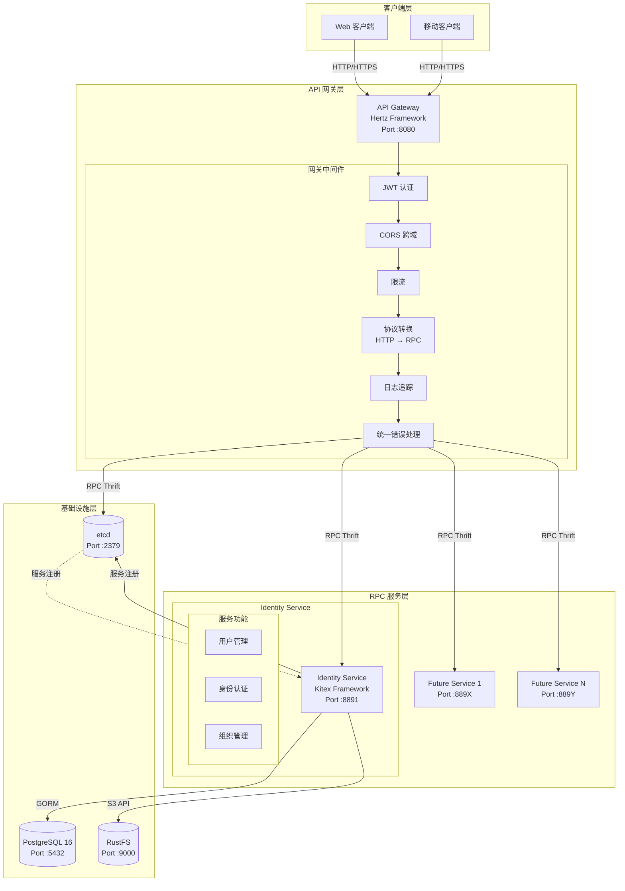
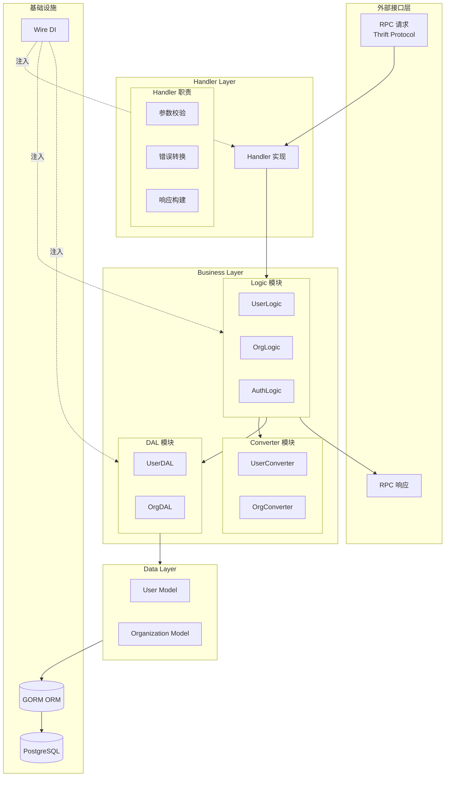

# 架构设计

本文档介绍 CloudWeGo Scaffold 的整体架构设计和技术选型。

## 目录

- [微服务架构](#微服务架构)
- [服务列表](#服务列表)
- [RPC 服务分层架构](#rpc-服务分层架构)
- [HTTP 网关分层架构](#http-网关分层架构)
- [技术栈](#技术栈)
- [关键设计决策](#关键设计决策)

---

## 微服务架构



### 架构特点

- **星型拓扑**：网关为中心，RPC 服务不互相调用
- **协议转换**：HTTP → Thrift RPC
- **服务发现**：基于 etcd 的动态服务发现
- **统一入口**：所有外部请求通过网关

---

## 服务列表

| 服务名称 | 框架 | 端口 | 描述 |
|----------|------|------|------|
| **gateway** | Hertz | 8080 | HTTP 网关，统一 API 入口 |
| **identity_srv** | Kitex | 8891 | 身份认证服务 |

---

## RPC 服务分层架构



### 目录结构

```
rpc/<service_name>/
├── handler.go           # RPC 接口实现（适配层）
├── biz/                 # 核心业务逻辑层
│   ├── converter/       # DTO ↔ Model 转换
│   ├── dal/             # 数据访问层
│   └── logic/           # 业务逻辑实现
├── models/              # GORM 数据模型
├── kitex_gen/           # IDL 生成代码（勿修改）
├── config/              # 服务配置
├── wire/                # Wire 依赖注入
└── internal/            # 内部实现
    └── middleware/      # RPC 中间件
```

### 分层职责

| 层 | 职责 | 示例 |
|----|------|------|
| **Handler** | 参数校验、调用转换器、委托业务逻辑 | `handler.go` |
| **Logic** | 核心业务逻辑、编排 DAL 操作 | `biz/logic/user_profile/` |
| **DAL** | 数据持久化、封装 GORM 操作 | `biz/dal/user_profile/` |
| **Converter** | DTO 与 Model 纯函数转换 | `biz/converter/user_profile/` |

---

## HTTP 网关分层架构

```
gateway/
├── biz/                  # HTTP 业务层（IDL 生成）
│   ├── handler/          # HTTP Handler
│   ├── model/            # HTTP DTO
│   └── router/           # 路由注册
├── internal/
│   ├── application/      # 应用层
│   │   ├── assembler/    # 数据组装器
│   │   └── middleware/   # 中间件
│   ├── domain/           # 领域层
│   │   └── service/      # 领域服务
│   └── infrastructure/   # 基础设施层
│       ├── client/       # RPC 客户端
│       ├── config/       # 配置管理
│       └── errors/       # 统一错误处理
└── docs/                 # Swagger 文档
```

---

## 技术栈

### 核心框架

| 组件 | 技术 | 说明 |
|------|------|------|
| RPC 框架 | [Kitex](https://github.com/cloudwego/kitex) | CloudWeGo 高性能 RPC |
| HTTP 框架 | [Hertz](https://github.com/cloudwego/hertz) | CloudWeGo 高性能 HTTP |
| 接口协议 | Thrift | IDL 定义 |

### 基础设施

| 组件 | 技术 | 说明 |
|------|------|------|
| 数据库 | PostgreSQL 16 + GORM | 关系型数据库 |
| 服务发现 | etcd | 服务注册与发现 |
| 对象存储 | RustFS | S3 兼容存储 |
| 依赖注入 | Google Wire | 编译时 DI |

---

## 关键设计决策

### 1. RPC 服务不互相调用

**决策**：所有 RPC 调用必须由网关发起，RPC 服务之间不直接调用。

**原因**：
- 简化微服务拓扑（星型架构）
- 统一管理认证、追踪、降级
- 易于监控和故障排查
- 降低服务间耦合

### 2. 安全逻辑集中在网关

**决策**：所有鉴权逻辑（JWT、权限校验）在网关层处理，RPC 服务不处理权限。

**原因**：
- 单点控制安全策略
- RPC 服务保持简单
- 便于安全审计

### 3. 环境变量驱动配置

**决策**：不使用 YAML 配置文件，所有配置通过环境变量或 `.env` 文件提供。

**原因**：
- 便于容器化部署
- 符合 12-Factor App 原则
- 环境隔离更清晰

### 4. Wire 编译时依赖注入

**决策**：使用 Google Wire 进行编译时依赖注入。

**原因**：
- 类型安全，编译时检查
- 无运行时反射开销
- 依赖关系清晰可追踪

---

## 下一步

- [开发指南](development-guide.md) - 了解如何开发新功能
- [配置说明](configuration.md) - 详细的配置参考
